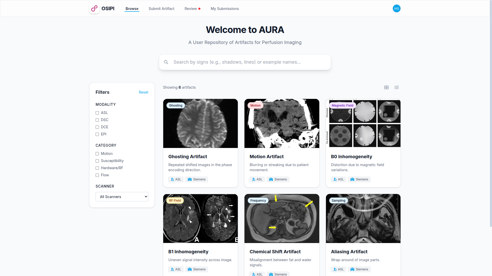
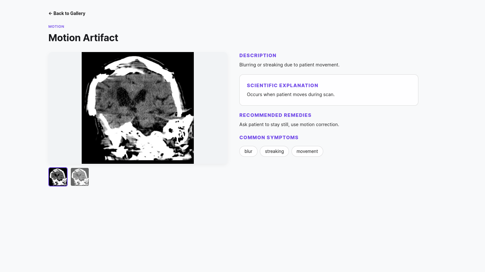
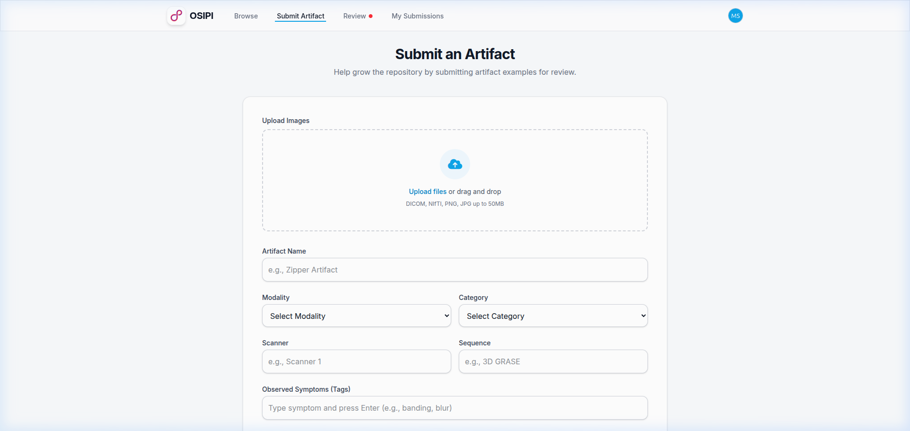

# AURA Platform (Prototype)

**A User Repository of Artifacts for Perfusion Imaging**

---

> [!IMPORTANT]
> **GSoC Prototype & Showcase Disclaimer**
> This repository is a **prototype** developed as part of a Google Summer of Code (GSoC) project. It serves as a **showcase frontend** to demonstrate the UI/UX and proposed architecture of the AURA platform.

> [!WARNING]
> **Functional Status**
> Currently, this is a **static frontend demonstration**. 
> - **Working Features**: **Browse/Search Artifacts** and the **Submit Artifact** form (submission is simulated).
> - **Inert Features**: Other sections such as Admin Dashboard, User Profiles, and Comparison views are currently **non-functional** or contain dummy data for demonstration purposes only.

---

## Project Overview

AURA (A User Repository of Artifacts for Perfusion Imaging) is a symptom-driven artifact repository designed to help clinicians and researchers identify, understand, and mitigate artifacts in perfusion imaging (ASL, DSC, DCE).

The platform aims to provide:
- A curated database of MRI artifacts with metadata (modality, sequence, category).
- Symptom-driven search to find artifacts based on visual appearance.
- Detailed information on artifact causes and potential remedies.
- A community-driven submission process for new artifact examples.

## Visual Overview

### AURA Platform Demo


### Home Page (Browse Artifacts)


### Artifact Detail View


### Submit Artifact Form


## Project Structure

- `/frontend`: React + Vite + Tailwind CSS application.
- `/docs`: Project documentation and architecture details.
- `/data`: Sample artifact data (JSON format).

## Getting Started (Frontend)

To run the showcase frontend locally:

1.  Navigate to the frontend directory:
    ```bash
    cd frontend
    ```
2.  Install dependencies:
    ```bash
    npm install
    ```
3.  Run the development server:
    ```bash
    npm run dev
    ```
4.  Open your browser to the URL provided in the terminal (usually `http://localhost:5173`).

## Tech Stack

- **Frontend**: [React 19](https://react.dev/), [Vite](https://vitejs.dev/)
- **Styling**: [Tailwind CSS 4](https://tailwindcss.com/)
- **Routing**: [React Router 7](https://reactrouter.com/)

---

*This project is built for the GSoC application process. All data currently shown is for demonstration purposes.*
