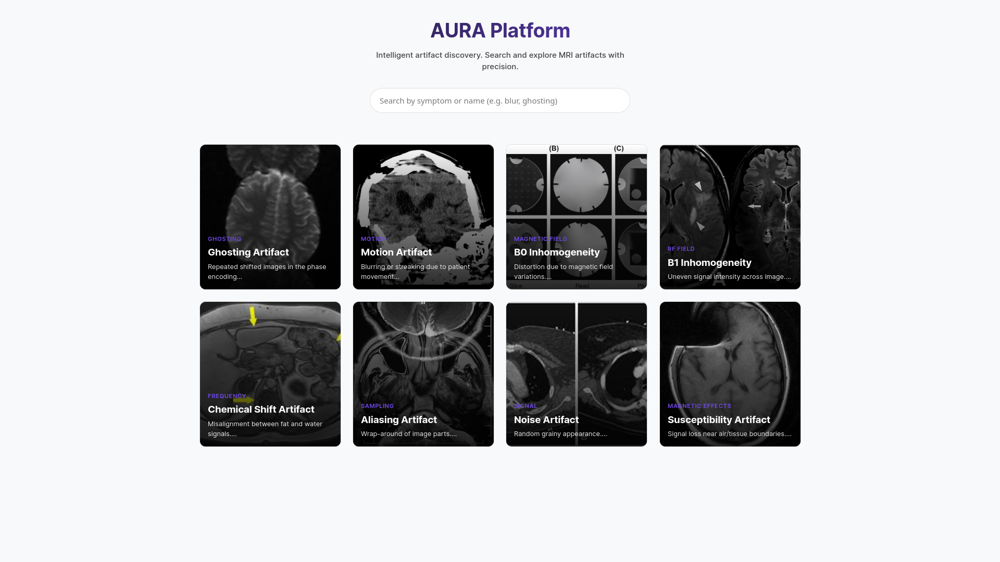

# AURA Platform (Prototype)

A simple prototype for exploring MRI perfusion imaging artifacts.

This project demonstrates how artifact data (currently collected via forms like REDCap) can be transformed into an interactive interface for browsing and understanding imaging artifacts.

---

## 🚀 What this prototype shows

* Basic artifact gallery UI
* Search by keyword (e.g., blur, motion)
* Individual artifact detail page
* Structured artifact data using JSON

---

## 📸 Screenshots

### Gallery View



### Detail View


---

## 🧠 Idea

This prototype focuses on:

* Turning raw data into a usable interface
* Making artifacts easier to browse and understand

---

## ⚙️ Run locally

```bash
git clone https://github.com/md61421/aura-platform.git
cd aura-platform
npm install
npm run dev
```

---

## ⚠️ Note

This is a **frontend-only prototype** built in a short time to demonstrate the concept.

* Data is static (JSON)
* No backend integration yet
* No real-time data syncing

---

## 📌 Future scope

* Add more artifact data
* Improve filtering & categorization

---

## 👤 Author

Md Sahil
https://github.com/md61421
